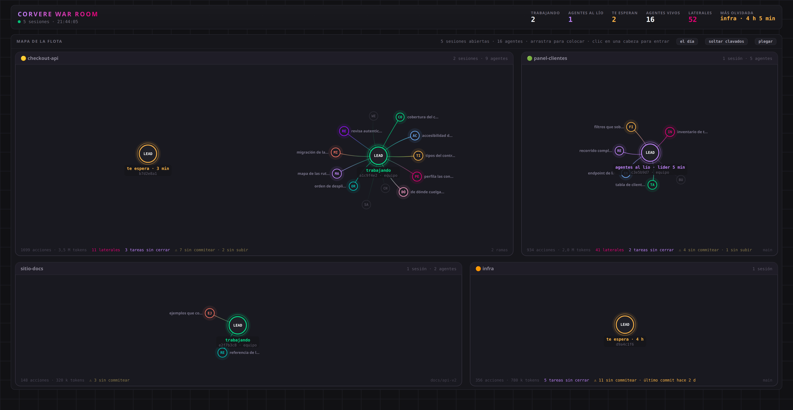
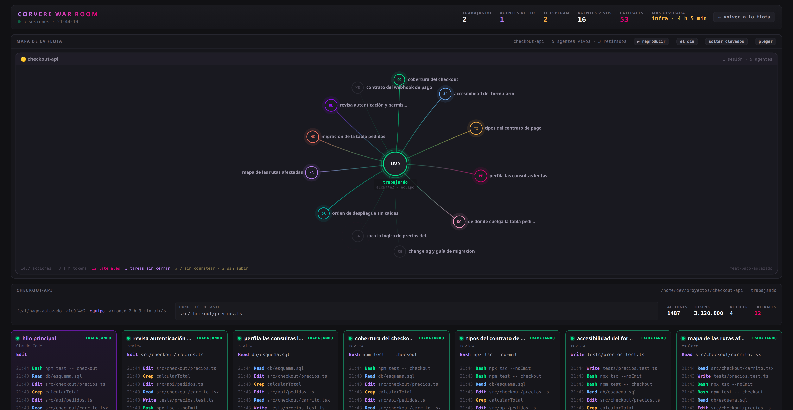

# War Room

Panel en vivo de la flota de agentes de Claude Code. En un monitor aparte o en
una ventana cualquiera, enseña qué sesiones tienes abiertas, cuáles están
trabajando, cuáles llevan horas esperándote, qué está haciendo cada agente ahora
mismo y quién habla con quién.

Solo lectura: no escribe nada dentro de `~/.claude`.

Sin dependencias: Node 20 o más nuevo y nada más. No hay `npm install` que valga,
ni en el servidor ni en el navegador.



Cada sesión es un pulpo: la cabeza es su hilo principal y los tentáculos sus
agentes. Las del mismo repositorio comparten zona. El color dice en qué anda
cada una, y la arista magenta es un mensaje que un agente le manda a otro sin
pasar por el líder.

---

## Antes de nada: esto enseña todo tu trabajo

El panel lee los transcripts de Claude Code, así que muestra los nombres de tus
proyectos, tus ramas, las tareas a medias y lo que escriben tus agentes. Por eso
el servidor **escucha solo en `127.0.0.1` y además comprueba la cabecera `Host`**
(ver [Seguridad](#seguridad)). Para verlo desde otro equipo, túnel SSH, nunca
abriendo el puerto.

## Dónde funciona

Leer transcripts funciona igual en los tres sistemas: viven en
`~/.claude/projects/<proyecto>/<sesión>.jsonl` (en Windows,
`%USERPROFILE%\.claude\`), con la misma estructura y los mismos
`<sesión>/subagents/agent-*.jsonl`. **Verificado en un Windows 11 real contra la
app de escritorio**, no deducido de la documentación.

Lo que cambia de un sistema a otro es saber **cuáles siguen abiertas**, porque el
transcript no lo dice: el de una sesión cerrada y el de una que lleva dos horas
esperándote son idénticos, en los dos casos el último apunte es viejo. Para eso
hay tres fuentes, y el panel usa la mejor que encuentre:

| Fuente | Qué aporta | Dónde |
|---|---|---|
| `claude agents --json` | `sessionId` exacto, nombre legible de la sesión y su estado | Las tres, si el CLI está instalado |
| `/proc` | Procesos `claude` vivos y su directorio de trabajo | Linux |
| ¿Corre la app de escritorio? | Solo eso: si corre, sus sesiones no pueden darse por cerradas | Las tres |

| Sistema | Estado |
|---|---|
| **Linux** | Completo. Es donde está desarrollado |
| **Windows con la app de escritorio** | Lee todo; mientras la app esté abierta no marca nada como cerrado |
| **Windows con el CLI** | Completo vía `claude agents` |
| **Windows con WSL2** | Completo, si Claude Code corre **también dentro de WSL** (son kernels distintos: desde WSL no se ven los procesos de Windows) |
| **macOS** | Como Windows: completo con el CLI instalado |

### Por qué la app de escritorio necesita trato aparte

No abre un proceso por sesión, sino **una sola aplicación con una docena de
procesos**, ninguno con el directorio de trabajo de una sesión concreta. Tampoco
deja el rastro en disco donde parecería: `sessions/` y `session-env/<uuid>/`
están vacíos. Y `claude agents --json`, con la app abierta y seis sesiones vivas,
**devuelve una lista vacía**: el CLI y la app no se ven entre ellos.

Así que de la app solo se puede saber si está corriendo, y resulta que es
justo lo que hace falta: una sesión del sidebar no muere al cerrar una terminal,
vive mientras viva la app. Mientras corra, ninguna de sus sesiones se marca como
cerrada, y el panel lo dice en la barra en vez de callárselo.

---

## Arrancarlo

```bash
npm run warroom      # y abrir http://127.0.0.1:7777
```

Eso vale en cualquier sistema. En Linux, para dejarlo como servicio de usuario
que arranca solo al iniciar sesión y se reinicia si se cae:

```bash
./install.sh
```

Es idempotente y genera el unit de systemd con la ruta de tu copia, así que se
puede repetir sin miedo.

**Ojo con el nombre: `install.sh` no instala dependencias**, porque no hay
ninguna que instalar. Lo único que hace es registrar el servicio. Para usar el
panel no hace falta ejecutarlo, y por eso tampoco hay `npm install` en ninguna
parte: `npm run warroom` arranca sobre Node pelado.

| Necesitas | Comando |
|---|---|
| Ver el log | `journalctl --user -u warroom -f` |
| Pararlo | `systemctl --user stop warroom` |
| Quitarlo del arranque | `systemctl --user disable warroom` |

### La ventana

`abrir.sh` coloca el panel en el monitor que le digas, con su propia instancia de
Chrome:

```bash
./abrir.sh                # el de la izquierda (por defecto)
./abrir.sh derecha
./abrir.sh centro
./abrir.sh izquierda full # modo kiosco, sin marco (Alt+F4 para salir)
```

Hay un script y no un comando suelto porque colocar la ventana a mano falla por
cuatro motivos, los cuatro medidos:

1. **Chrome ya abierto ignora la geometría.** Si se lanza con tu perfil normal y
   ya tienes Chrome corriendo, la instancia existente atiende la petición y
   descarta `--window-position` y `--window-size`. Por eso el script usa un
   perfil aparte en `~/.config/warroom-chrome`.
2. **El escalado del escritorio multiplica las medidas.** Con `Xft.dpi=120` (una
   escala del 125 %), pedir 1920 de ancho crea una ventana de 2400 y el gestor la
   empuja fuera del monitor. El script divide tamaño *y* posición por la escala,
   que lee de `xrdb`.
3. **La geometría de los monitores no se hardcodea.** Se lee de `xrandr`, así que
   si cambias una pantalla de sitio sigue funcionando.
4. **Se respeta el área útil, no el borde físico.** El dock de Ubuntu se come los
   primeros píxeles del monitor izquierdo, así que el script recorta contra
   `_NET_WORKAREA` para no quedarse medio tapado.

Necesita X11 (`xrandr`, `xrdb`, `xprop`). En Wayland, macOS o Windows, abre el
navegador a mano.

---

## Las dos vistas

**El mapa** ocupa la pantalla entera. Cada sesión es un pulpo: la cabeza es su
hilo principal y los tentáculos sus agentes. Las sesiones del mismo repositorio
comparten zona, así que un repo con tres sesiones abiertas se ve como tres pulpos
en la misma caja.

Las zonas se reparten en **dos columnas**, y **cada repo ocupa según lo que
contiene**: uno con tres sesiones y quince agentes se lleva mucho más sitio que
uno con una cabeza sola. Nada está en posición fija (muelles, repulsión y
flotación) y los nodos se contienen dentro de la caja de su repo.

- **Arrastra** cualquier nodo. Si coges una cabeza, se lleva su pulpo detrás.
- Al soltar queda **clavado** (anillo de puntos); clic seco para liberarlo.
- **Clic en una cabeza** abre el detalle de esa sesión.
- Los agentes se identifican por **silueta** (familia), **iniciales** que
  distinguen (se descartan las palabras que comparten con sus hermanos, así que
  once agentes `council-*` son DE, HI, EC, OP… y no once "CO") y **nombre al
  lado** cuando hay sitio.
- Los mensajes viajan **por el cable**, con estela, y el receptor acusa recibo con
  un destello. Magenta si es lateral entre agentes, morado si va al líder.

**El detalle** (clic en una cabeza, `Esc` para volver) es el mismo mapa en modo
foco: esa sesión se queda sola y se abre para ocupar todo el lienzo, con los
nombres de sus agentes siempre visibles. Debajo, la ficha de la sesión (rama,
cuánto lleva viva, **dónde lo dejaste**, acciones, tokens y mensajes), el stream
de cada agente, los retirados, el tablero compartido y el feed de mensajes.



### Los tres estados

| Estado | Qué significa | Cómo se detecta |
|---|---|---|
| **Trabajando** | El líder está escribiendo ahora | Su transcript creció hace menos de 45 s |
| **Agentes al lío** | El líder está bloqueado esperando a sus agentes, **tú estás libre** | El líder lleva parado pero algún agente escribió hace menos de 45 s |
| **Te espera** | Todo parado: te toca a ti | Hay proceso vivo y nadie escribe |
| **Cerrada** | Ya no existe | No hay proceso `claude` con ese `cwd` |

Los dos estados de "parado" son distintos y solo uno te reclama.

El **icono de la pestaña** lleva ese mismo semáforo en el punto de su esquina:
ámbar en cuanto alguna sesión te reclama, verde si la flota está a lo suyo, gris
si no hay nada vivo. Así el aviso también llega con el panel en otro monitor o en
una pestaña de fondo.

**Ojo con mirar solo al líder.** Cuando despliega agentes se queda bloqueado
esperándolos y no escribe: medido en transcripts reales, **hasta 21,8 minutos de
silencio con 12 agentes trabajando**. Si el estado saliera solo de su transcript,
esa sesión aparecería como "te espera desde hace 22 minutos" estando a pleno
rendimiento. Por eso cuenta la actividad de todos.

### Mensajes laterales

El contador de **laterales** cuenta los mensajes de un agente a otro sin pasar por
el líder. Es la métrica que distingue un equipo de un fan-out. Cuando aparece
uno, se dibuja una arista magenta entre los dos nodos y se queda ahí como huella
de que esos dos colaboraron.

---

## Cómo funciona por dentro

`server.mjs` barre `~/.claude/projects` cada 3 segundos (54 ms para 5.500
transcripts) y lee de forma incremental solo lo nuevo de cada fichero. Al
descubrir uno arranca por la cola, no por el principio: hay transcripts de 6 MB y
1,4 GB en total.

Del transcript del líder saca los `Agent` (nacimientos), y de cada
`subagents/*.jsonl` la actividad de ese agente. Los agentes sin nombre propio se
emparejan con el spawn del líder más cercano en el tiempo, que es de donde sale su
rol real. Si no hay spawn a mano, se deduce del prompt inicial.

El estado se manda al navegador por SSE una vez por segundo.

### Seguridad

Escucha **solo en `127.0.0.1`**, y eso por sí solo no basta: con *DNS rebinding*
una web cualquiera puede hacer que su dominio resuelva a `127.0.0.1`, y entonces
el navegador considera que el origen es suyo y **puede leer las respuestas**. Por
eso el servidor comprueba además la cabecera `Host` y rechaza lo que no venga de
este equipo. Los cambios de estado van por `POST`, nunca por `GET`, para que no
los dispare una etiqueta `` ajena.

**No endurezcas el servicio con `PrivateTmp` ni `ProtectSystem`.** Suena a buena
idea y rompe el panel en silencio: ambas meten el servicio en un *mount namespace*
propio, y desde ahí `readlink /proc/<pid>/cwd` de los procesos de Claude Code da
`EACCES`. Sin ese dato no se puede distinguir una sesión que te espera de una
cerrada, y salen todas como cerradas sin un solo error en el log. Medido: sin
opciones, 6 de 6 `cwd` legibles; con cualquiera de las dos, 0 de 6.

La protección real está en el diseño: el servidor solo abre ficheros en lectura.

---

## Ajustes

La configuración vive en `~/.config/warroom/env`, **fuera del repositorio** y en
permisos 600. `install.sh` lo crea vacío la primera vez. Todo es opcional:

```ini
WARROOM_ALERTAS=1
WARROOM_ALERT_URL=https://…/mi-endpoint
WARROOM_ALERT_KEY=…
```

Con eso, el panel manda un aviso a ese endpoint cuando una sesión lleva 3 h
esperándote, cuando un repo lleva 24 h con cambios sin guardar o cuando un agente
lleva 20 min sin dar señales. Sin URL o sin clave no se manda nada. El cuerpo es
`{ source, notify, severity, event_type, title, message, metadata }` y la clave
viaja en la cabecera `x-admin-key`.

El puerto se cambia con `WARROOM_PORT` (por defecto 7777).

Lo demás son constantes arriba de `server.mjs`:

| Constante | Qué controla | Valor |
|---|---|---|
| `SCAN_MS` | Cada cuánto se barre la flota | 3 s |
| `WORKING_S` | Umbral de "trabajando" | 45 s |
| `MAX_AGE_H` | Ventana de transcripts a mirar | 36 h |
| `TAIL_LEAD` / `TAIL_SUB` | Cuánto se lee al descubrir un fichero | 4 MB / 512 KB |

---

## Licencia

MIT. Ver [LICENSE](LICENSE).
